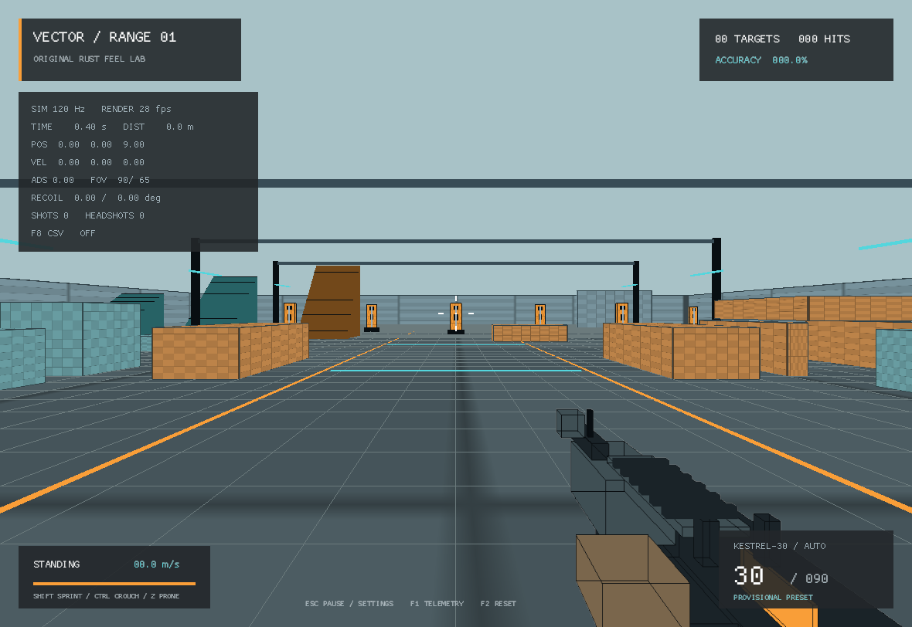

# VECTOR RANGE

Can AI build a game from footage alone?



## Model conversion and tuning

- [Python converter and binary format](docs/ASSET_FORMAT.md)
- [Automatic source-to-game builds and cache validation](docs/AUTHORED_ASSET_CI.md)
- [Blender-first Actions/NLA export and opt-in playback](docs/BLENDER_AUTHORING_PIPELINE.md)
- [Model rights and exact FBX preparation](assets/README.md)
- [M4 candidate sources, assumptions and uncertainty](docs/M4_PROFILE.md)

GLB is already binary. This converter creates actual game mesh records, rather
than renaming/wrapping GLB, but **it does not prevent reconstruction or extraction**.
Permission, not obfuscation, determines whether an asset may be distributed.

```sh
python tools/vrpack.py pack private-assets/weapon.glb private-assets/weapon.vrm
python tools/vrpack.py inspect private-assets/weapon.vrm
cargo run --release -- --weapon-asset=private-assets/weapon.vrm
cargo run --release -- --profile=kestrel --procedural-weapon
```

`--profile=m4a1` is the default. It loads `settings.cfg` on top of the candidate.
`--profile=kestrel` loads `profiles/kestrel.cfg` on top of the authored original.
`--settings=PATH` chooses a different override file; F5/F6 save/reload that same path.
The model choice is independent of the gameplay profile. Missing or invalid runtime
model assets produce a visible fallback warning. Invalid model data blocks play with
an actionable error instead of silently hiding it. `--procedural-weapon` explicitly
selects primitives. Double-clicking the EXE automatically checks its adjacent
`assets/weapons/hk416a5.vrm`, independent of the process working directory.

## Play

Install stable Rust from [rustup.rs](https://rustup.rs/), then in this directory:

```sh
cargo run --locked --release
```

Windows: use the default **x86_64-pc-windows-msvc** Rust toolchain and Microsoft's
C++ Build Tools if rustup requests them. No game files or asset downloads are needed.
GitHub Actions builds the Windows game for the PR; download the Windows
artifact from the completed **Rust prototype checks and playable builds** run.
An executable build is not a substitute for a Windows gameplay test.

Linux needs an X11 display, OpenGL, and ALSA development files for building audio.
On Debian/Ubuntu: `sudo apt-get install build-essential libasound2-dev libx11-dev libxi-dev libgl1-mesa-dev`.
For a silent build without ALSA: `cargo run --locked --release --no-default-features`.
macOS uses Xcode command-line tools; not runtime-tested here.

Click Enter the Range or press Enter to start. Escape pauses and releases the mouse. All gameplay
runs offline; there are no network calls, accounts, multiplayer, game-file readers,
or anti-cheat interactions.

| Control | Action |
| --- | --- |
| WASD / mouse | Move / look |
| Left mouse / right mouse | Hold automatic fire / press to toggle ADS |
| Left Shift | Hold sprint |
| Left Ctrl or C / Z | Press to toggle crouch / press to toggle prone |
| Space | Jump or mantle a clear ledge while moving forward; lower stance requests standing first |
| R | Reload |
| F | Hold near and looking at the rear-wall ammo supply to refill |
| Escape / Enter or Resume button | Pause / resume |
| Pause-menu X/Y/Z walking sliders | Save independent per-weapon walking translation |
| F1 / F2 | Telemetry overlay / reset range and inventory |
| Shift double-tap | Tactical sprint |
| Ctrl/C or Z while sprinting | Slide / dolphin dive |
| V (or hold ADS on cover) | Mount / unmount the weapon |
| Jump at a high ledge / Space / Ctrl / 2 | Catch and hang / pull up / drop / sidearm (no sidearm in the default loadout) |
| F9 | Debug: kill the player to test death/respawn |
| Q / E | Toggle lean left / right (press the other key to switch sides) |
| Left Ctrl + X | Toggle hip cant (weapon rolls about its bore; hidden while aiming) |

Traversal and weapon-action states, tuning and animation slots: [traversal](docs/TRAVERSAL.md)
and its [acceptance checklist](docs/TRAVERSAL_ACCEPTANCE.md). All of their visuals are placeholders.
| `[` / `]` | Lower / raise mouse sensitivity |
| `-` / `=` | Lower / raise horizontal hip FOV |
| F5 / F6 | Save / reload selected settings file |
| F8 | Start/stop local `telemetry.csv` recording; starting overwrites the old file |
| M / F11 / F10 | Mute / fullscreen / quit |

ADS, crouch, and prone use press-to-toggle by default. Press the same stance key
again to stand, or the other stance key to switch directly. Space clears a toggled
lower stance and requests standing first; clearance and smooth transitions still
apply. A fresh Shift press cancels toggled ADS. Use `--hold-controls` to restore
hold-to-ADS/crouch/prone. See [control behavior and checks](docs/CONTROLS.md).

The first resume click does not fire. Pause, resume, reset, and detected focus loss
clear ADS/stance intentions; held buttons must be released before reactivation.
Windows foreground focus loss pauses and releases the cursor. Returning stays paused
until a fresh resume; a fresh Alt/Super shortcut also pauses. Long frame hitches discard stale timing/input
without changing pause state, so a slow frame cannot trap the game in pause.
Escape toggles pause; Enter or the Resume button also resumes. See
[walking controls and focus behavior](docs/WALK_AXIS_SETTINGS.md).

## What's implemented

- Deterministic 120 Hz simulation, frame-rate-independent movement and weapon timers
- Acceleration, friction, directional speeds, limited air steering, jump/landing,
  four-second sprint budget, exhaustion latch, crouch/prone clearance, eased camera height
- Original AABB collision and analytic wedge fixtures at 30, 45 and 50 degrees
- Swept low/high mantle traversal with clearance checks and pause cancellation
- Optional private skinned arms with original IK, authored reload staging and cancellation blending
- Aim/range/occlusion-gated rear-wall ammo supply with hold-F progress and full refill
- Accumulated 70 ms candidate / 90 ms original fire schedule, independent recoil/spread random streams,
  uniform-solid-angle spread, ADS in/out, hip bloom, separate camera and gun kick
- Tactical/empty reload credit and ready milestones, safe tactical sprint cancellation,
  sprint-to-fire gate, ammo conservation, eye/muzzle obstruction checks
- Converted static weapon plus procedural fallback, primitive targets, UV checks, meter floor grid, colored lanes,
  step thresholds, clearance tunnels, dispersion board, hit feedback
- Original in-memory synthesized shot, hit, footstep, and reload sounds
- Live settings and local CSV telemetry; no telemetry is transmitted

## Verify

```sh
python -m pip install -r tools/requirements-assets.txt cryptography
python -m unittest discover -s tools -p "test_*.py" -v
cargo fmt --all -- --check
cargo clippy --locked --all-targets -- -D warnings
cargo test --locked
cargo run --locked --example measure
cargo build --locked --release
```

`cargo run --release -- --capture` renders a native frame to `capture.png` and exits.
`--demo` holds aim/fire for graphical diagnostics. `--capture-ads` and
`--capture-fixtures` select additional deterministic camera views. These modes
require a graphical display. Unit/integration tests do not.

## Tuning and architecture

`src/sim.rs` owns gameplay; `src/settings.rs` owns validated, human-editable tuning;
`src/main.rs` owns input/presentation; `src/sound.rs` synthesizes audio without files.
The renderer is [Macroquad](https://macroquad.rs/), pinned in Cargo.toml and Cargo.lock.
One reference unit is **0.0254 m by authored convention**. FOV is horizontal and
converted to the renderer's vertical-radian convention.

See [tuning](docs/TUNING.md), [provenance](docs/PROVENANCE.md), and
[verification](docs/VERIFICATION.md). This is a source-informed, independently
written implementation, not a strict legal clean-room certification.

## Deliberate limits

Single-player keyboard/mouse gameplay. No multiplayer, controller/aim assist,
ladders, penetration, destruction, AI combat, attachments, or retail assets.
Collision supports axis-aligned boxes and the authored wedge fixtures, not arbitrary
mesh geometry. The level uses diagnostic primitive art; the untextured weapon uses simple diffuse
shading, not full PBR. Optional private skinned arms use authored IK and reload motion;
hand fit and animation remain provisional. See [arms](docs/FIRST_PERSON_ARMS.md),
[mantling](docs/MANTLING.md), and [ammo interaction](docs/AMMO_SUPPLY.md).
The ammo box is an original geometric placeholder pending the reference model.
The game [checks for updates on launch](docs/UPDATER.md), with a centered loading screen
before the test world becomes playable, off-thread downloads, and pause/resume/cancel
controls in its own window. Offline/error recovery offers an explicit play-current-version choice. The native engine does not
expose a universal focus callback to this application: fresh Alt/Super shortcuts
pause safely, but every OS focus-change path is not covered. Always press
Escape before switching apps. Retail comparison and blinded feel testing remain open.
